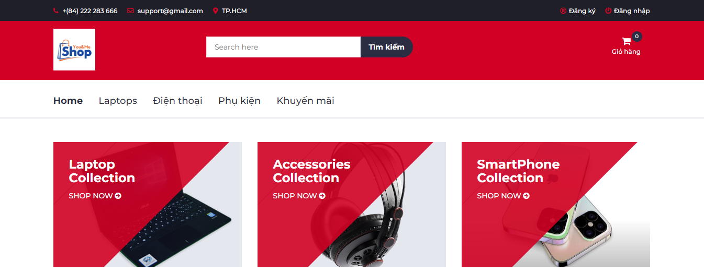
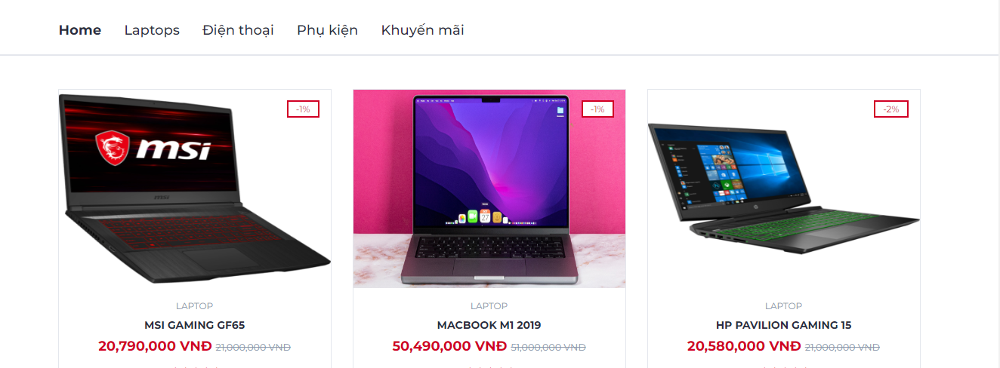
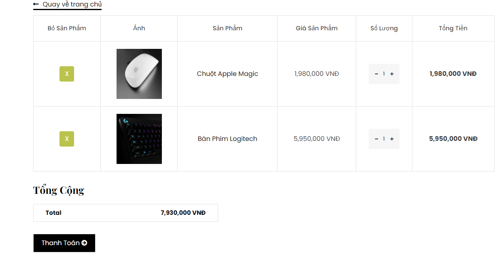
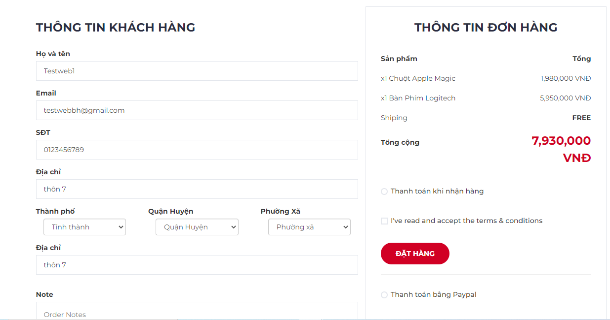
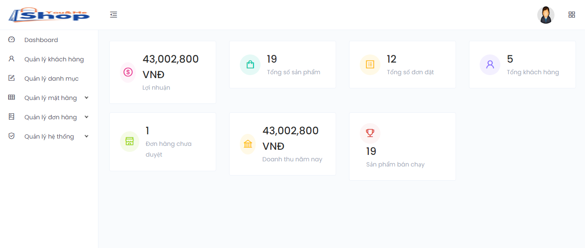

# ĐỒ ÁN TỐT NGHIỆP NĂM HỌC 2021-2022

* Họ và tên: NGUYỄN THANH QUI

* MSV: 5951071086

* Lớp: Công nghệ thông tin-K59

* GVHD: ThS. NGUYỄN LÊ MINH

## Đề tài: Xây dựng WEBSITE bán thiết bị điện tử

## Phần 1: Công nghệ sử dụng:
 * Sử dụng ngôn ngữ lập trình C#
 * Framework:  Entity framework 
 * Visual Studio 2019
 * SQL server 2019

## Phần 2: Các chức năng chính:
1. Phân quyền 
2. Tìm kiếm sản phẩm 
3. Gửi mail cho khách hàng.
4. Thêm, Xóa, Sửa sản phẩm.
5. Thanh toán online PAYPAL
6. Quản lý sản phẩm theo danh mục và theo thương hiệu.

## Hướng dẫn sử dụng:
1. Cần cài đặt SQL server khuyến nghị nên 2017 2019
2. Cần cài đặt Visual studio  khuyến nghị nên 2017 2019 
3. vào https://github.com/thanhqui9283/DOAN_TN để tải source code về
4. khi đã tải về Import database EcommerceVer2.sql vào trong Sql Server
5. mở Chương trình lên vào appsettings.json -> ConnectionStrings đưa database của máy mình vào và chạy chương trình 

Xin cám ơn!

## Hình ảnh Demo:

